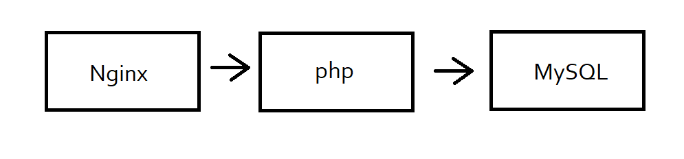

# zadanie2
Aplikacja służąca do obliczania wartości ciągu geometrycznego.
Serwer Nginx + interpreter php + baza danych MySQL.
Pomimo prób nie udało mi się połączyć z bazą danych MySQL, a więc dane są przechowywane na serwerze w sesji.

